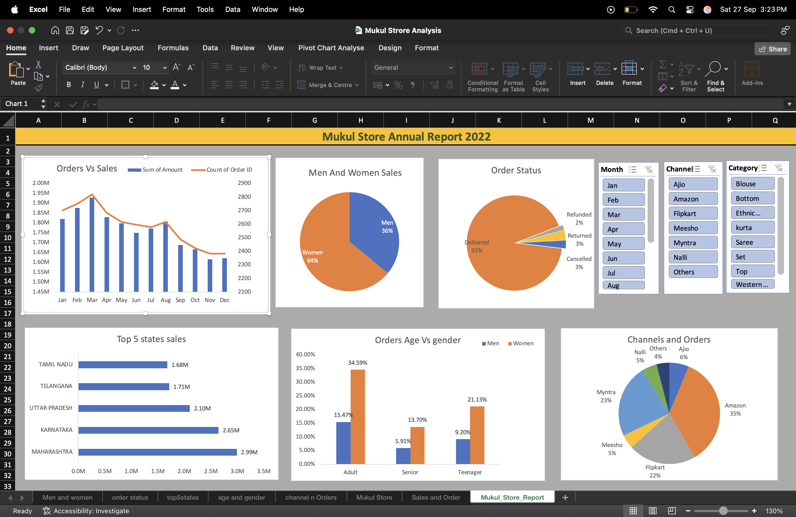

# 🛍️ Mukul Store Annual Report 2022




This project presents an **interactive Excel dashboard** for analyzing sales and order trends of Mukul Store in the year 2022. It highlights performance across states, sales channels, customer demographics, and order status.

---

## 📊 Project Overview

* Built using **Microsoft Excel (Pivot Tables, Pivot Charts, Slicers)**
* Provides insights on **sales, orders, and customer demographics**
* Helps identify top-performing regions, channels, and customer segments
* Interactive filters for **Month, Channel, and Category**

---

## 🔑 Key Insights

1. **Orders vs Sales Trend**

   * Sales peaked in **March and April** before a steady decline towards the year-end.
   * Despite fluctuations, the store maintained **over ₹1.5M monthly sales**.

2. **Customer Demographics**

   * **Women contributed 64% of total sales**, compared to 36% by Men.
   * Adults dominate the customer base (**34.59% orders**), followed by Teenagers (**21.13%**) and Seniors (**13.70%**).

3. **Order Status**

   * **92% of orders were successfully delivered**, with minimal cancellations (3%), returns (3%), and refunds (2%).

4. **Regional Performance**

   * **Maharashtra (₹2.99M)** and **Karnataka (₹2.65M)** lead in sales.
   * Uttar Pradesh (₹2.10M) also shows strong performance.

5. **Sales Channels**

   * **Amazon is the top channel (35% share)**, followed by Flipkart (22%) and Myntra (23%).
   * Ajio (6%), Meesho (5%), and Nalli (4%) account for smaller shares.

---

## 📂 Repository Structure

```
Mukul-Store-Excel-Analysis/
│── Mukul Strore Analysis.xlsx   # Main Excel dashboard file
│── images/
│   └── Mukul_Store_Report.png   # Dashboard screenshot
│── README.md                    # Project documentation
```

---

## 🛠 Tools Used

* **Microsoft Excel** (Pivot Tables, Charts, Slicers, Data Cleaning)
* **Data Visualization**: Line Charts, Pie Charts, Bar Charts

---

## 🚀 How to Use

1. Clone the repository

   ```bash
   git clone https://github.com/MukulSSrank/Mukul-Store-Excel-Analysis.git
   ```
2. Open the file **`Mukul Strore Analysis.xlsx`** in Microsoft Excel.
3. Use slicers to filter by **Month, Channel, and Category**.

---

## 🙌 Author

👤 **Mukul Latwal**
⭐ *If you found this project insightful, don’t forget to star the repo!* ⭐
